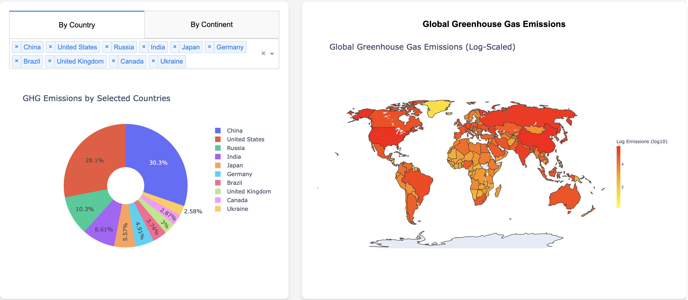

# Greenhouse Gas Emissions Dashboard

### About the Project

The **GHG Emissions Dashboard** provides an interactive visualization of global greenhouse gas emissions using **data from the European Commission's EDGAR database**. The dashboard allows users to explore emission trends, compare emissions across countries and continents, and interact with dynamic charts and maps.

### Key Features

**GHG Growth Trends** – Evolution of emissions in the Euro Area, EU27, and worldwide.\
**GHG Emissions by Income Groups** – Comparison of emissions per capita based on World Bank income classifications.\
**Country & Continent Contribution** – Breakdown of total global emissions by individual countries and continents.\
**Interactive Visualization** – Dynamic charts and maps using Dash and Plotly.\
**Choropleth World Map** – Visualize GHG emissions per country with color scaling.

### Technologies Used

- **Python** (Dash, Plotly, Pandas, NumPy)
- **Data Processing & Visualization**
- **Deployment on Render & GitHub Pages**

### Dashboard Example

Below is the example of the dashboard that is deployed.



### Future Enhancements

 **Prediction Model** – Implement machine learning (ARIMA, LSTM) to predict future GHG emissions.\
 **Time Slider for the Map** – Add a year-based slider to explore emissions over time dynamically.\
 **Enhanced UI** – Improve styling, responsiveness, and overall UX.

---

## How to Run Locally

### **1. Clone the Repository**

```bash
git clone https://github.com/oztuncbilek/ghg-dashboard.git
cd ghg-dashboard
```

###  **2. Set Up a Virtual Environment (Recommended)**

```bash
python -m venv venv
source venv/bin/activate  # MacOS/Linux
venv\Scripts\activate    # Windows
```

###  **3. Install Dependencies**

```bash
pip install -r requirements.txt
```

###  **4. Run the Application**

```bash
python app.py
```

 Open [**http://127.0.0.1:8050/**](http://127.0.0.1:8050/) in your browser to access the dashboard.

---

##  Deployment

The project is deployed on **Render**.  **Live Demo:** [https://ghg-dashboard.onrender.com/]

## Data Source

**European Commission - EDGAR GHG Emissions Report**\
 [EDGAR Data Download](https://edgar.jrc.ec.europa.eu/report_2024?vis=ghgpop#data_download)


